# Jarkom-Modul-5-E13-2023

| No | Nama | NRP |
|----------|----------|----------|
| 1 | Nadya Permata Sari | 5025201015 |
| 2 | Najma Ulya Agustina | 5025211239 |

<h2>Daftar Isi</h2>

| Soal | Solusi | Testing |
|----------|----------|----------|
| [Soal 1](#soal-1) | [Solusi](#solusi1) | [Testing](#testing1) |
| [Soal 2](#soal-2&3) | [Solusi](#solusi2&3) | [Testing](#testing2&3) |
| [Soal 3](#soal-2&3) | [Solusi](#solusi2&3) | [Testing](#testing2&3) |
| [Soal 4](#soal-4) | [Solusi](#solusi4) | [Testing](#testing4) |
| [Soal 5](#soal-5) | [Solusi](#solusi5) | [Testing](#testing5) |
| [Soal 6](#soal-6) | [Solusi](#solusi6) | [Testing](#testing6) |
| [Soal 7](#soal-7) | [Solusi](#solusi7) | [Testing](#testing7) |
| [Soal 8](#soal-8) | [Solusi](#solusi8) | [Testing](#testing8) |
| [Soal 9](#soal-9) | [Solusi](#solusi9) | [Testing](#testing9) |
| [Soal 10](#soal-10) | [Solusi](#solusi10) | [Testing](#testing10) |

<h2>Persiapan</h2>
Sebagai persiapan, terdapat beberapa poin yang harus dilakukan yang tertuang dalam soal sebagai berikut:

 **<h3>`Tugas A`</h3>**
 
Tugas pertama yaitu membuat topologi jaringan sesuai dengan rancangan yang diberikan seperti di bawah ini:


Hasil Topologi yang sudah dibuat:


Terdapat beberapa node yang memiliki peran khusus, yaitu sebagai berikut:

- Richter adalah DNS Server
- Revolte adalah DHCP Server
- Sein dan Stark adalah Web Server
- Jumlah Host pada SchwerMountain adalah 64
- Jumlah Host pada LaubHills adalah 255
- Jumlah Host pada TurkRegion adalah 1022
- Jumlah Host pada GrobeForest adalah 512

 **<h3>`Tugas B`</h3>**

Untuk menghitung rute-rute yang diperlukan, gunakan perhitungan dengan metode VLSM. Buat juga pohonnya, dan lingkari subnet yang dilewati!

- Pengelompokan pada topologi yang telah dibuat:

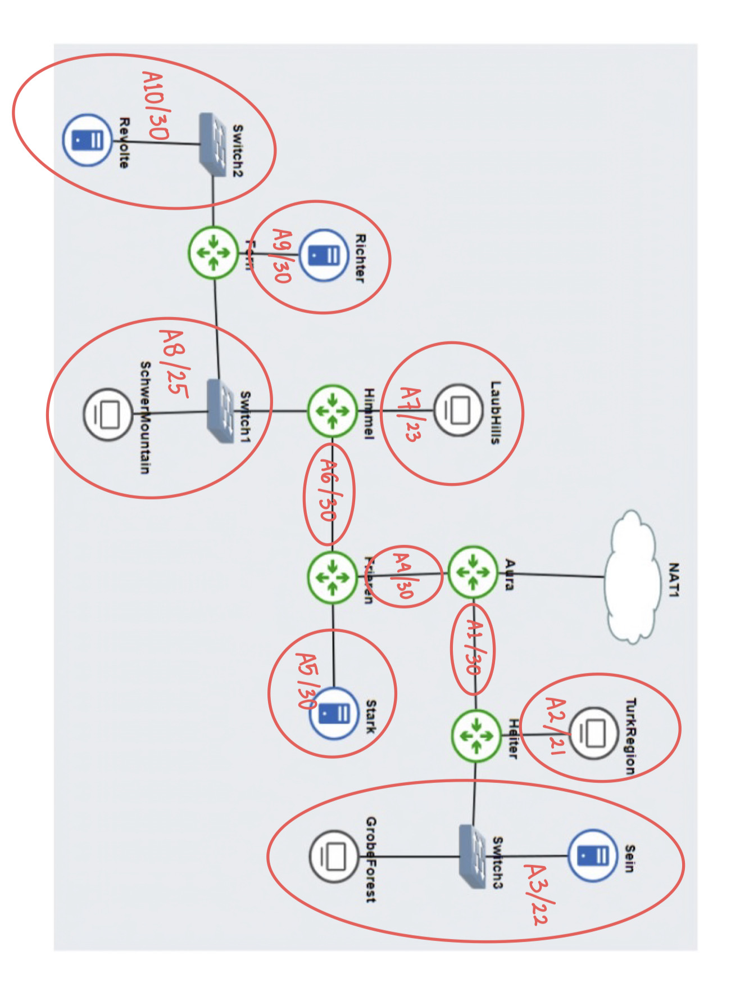

- Selanjutnya, dilakukan analisis sehingga didapatkan hasil sebagai berikut:

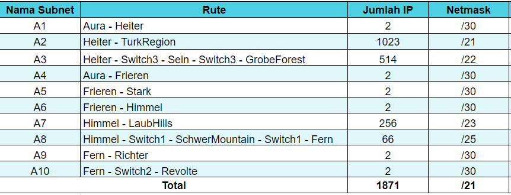

- Berdasarkan total IP host dan netmask yang dibutuhkan, root subnet yang dibentuk memiliki NID 10.43.0.0 dengan netmask /20 dan jumlah IP Host sebanyak 1871. Kemudian, alokasi IP Address secara keseluruhan dapat dibuat menjadi seperti berikut.

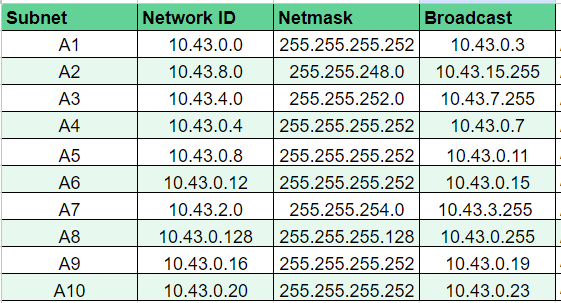

- Tidak lupa, dibuat IP Address Tree untuk mempermudah visualisasi dari subnetting yang telah dibuat sebagai berikut:


 **<h3>`Tugas C`</h3>**
 
Kemudian buatlah rute sesuai dengan pembagian IP yang kalian lakukan!

Pada poin ini, dilakukan beberapa konfigurasi yang meliputi konfigurasi IP Address tiap node, konfigurasi routing, serta konfigurasi node server.

- Konfigurasi IP Address tiap Node:

  **Aura**
```
auto eth0
iface eth0 inet dhcp

auto eth1
iface eth1 inet static
	address 10.43.0.1
	netmask 255.255.255.252


iface eth2 inet static
	address 10.43.0.5
	netmask 255.255.255.252
```

**Heiter**
```
auto eth0
iface eth0 inet static
	address 10.43.0.2
	netmask 255.255.255.252

auto eth1
iface eth1 inet static
	address 10.43.8.1
	netmask 255.255.248.0


auto eth2
iface eth2 inet static
	address 10.43.4.1
	netmask 255.255.252.0
```

 **Frieren**
 ```
auto eth0
iface eth0 inet static
	address 10.43.0.6
	netmask 255.255.255.252

auto eth1
iface eth1 inet static
	address 10.43.0.13
	netmask 255.255.255.252

auto eth2
iface eth2 inet static
	address 10.43.0.9
	netmask 255.255.255.252
```

 **Himmel**
```
auto eth0
iface eth0 inet static
	address 10.43.0.14
	netmask 255.255.255.252

auto eth1
iface eth1 inet static
	address 10.43.2.1
	netmask 255.255.254.0

auto eth2
iface eth2 inet static
	address 10.43.0.129
	netmask 255.255.255.128
```

  **Fern**
```
auto eth0
iface eth0 inet static
	address 10.43.0.130
	netmask 255.255.255.128

auto eth1
iface eth1 inet static
	address 10.43.0.17
	netmask 255.255.255.252

auto eth2
iface eth2 inet static
	address 10.43.0.21
	netmask 255.255.255.252
```

 **Sein**
```
auto eth0
iface eth0 inet static
	address 10.43.4.3
	netmask 255.255.252.0
	gateway 10.43.4.1
```

 **Stark**
```
auto eth0
iface eth0 inet static
	address 10.43.0.10
	netmask 255.255.255.252
	gateway 10.43.0.9
```

 **Richter**
```
auto eth0
iface eth0 inet static
	address 10.43.0.18
	netmask 255.255.255.252
	gateway 10.43.0.17
```

 **Revolte**
```
auto eth0
iface eth0 inet static
	address 10.43.0.22
	netmask 255.255.255.252
	gateway 10.43.0.21
```

 **TurkRegion**
 ```
auto eth0
iface eth0 inet static
	address 10.43.8.2
	netmask 255.255.248.0
	gateway 10.43.8.1
```

  **GrobeForest**
```
auto eth0
iface eth0 inet static
	address 10.43.4.2
	netmask 255.255.255.0
	gateway 10.43.4.1
```

  **LaubHills**
```
auto eth0
iface eth0 inet static
	address 10.43.2.2
	netmask 255.255.254.0
	gateway 10.43.2.1
```

 **SchwerMountain**
```
auto eth0
iface eth0 inet static
	address 10.43.0.131
	netmask 255.255.255.128
	gateway 10.43.0.129
```

- Konfigurasi Routing pada tiap Router:

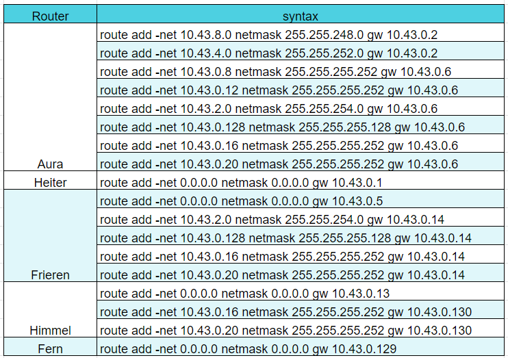

Agar client bisa terhubung ke internet, perlu dilakukan konfigurasi iptables pada router yang berhubungan dengan NAT, yaitu Aura. Kemudian, simpan kedalam file `.bashrc.`

```
echo 'iptables -t nat -A POSTROUTING -o eth0 -j MASQUERADE -s 10.43.0.0/16 ' >> .bashrc
```


 **<h3>`Tugas D`</h3>**

Tugas berikutnya adalah memberikan ip pada subnet SchwerMountain, LaubHills, TurkRegion, dan GrobeForest menggunakan bantuan DHCP

- Konfigurasi Node Server:


Client 
```
auto eth0
iface eth0 inet dhcp
```

DNS Server (Richter)
```
echo 'nameserver 192.168.122.1 ' > /etc/resolv.conf

apt update
apt install bind9 -y

echo '
options {
    directory "/var/cache/bind";
    forwarders {
        192.168.122.1;
    };
    allow-query { any; };
    auth-nxdomain no;    # conform to RFC1035
    listen-on-v6 { any; };
}; ‘ > /etc/bind/named.conf.options

service bind9 restart
```

DHCP Server (Revolte)
```
echo 'nameserver 192.168.122.1 ' > /etc/resolv.conf

apt update
apt install isc-dhcp-server -y
echo 'INTERFACES="eth0" ‘ > /etc/default/isc-dhcp-server

echo 'ddns-update-style none;
option domain-name "example.org";
option domain-name-servers ns1.example.org, ns2.example.org;
default-lease-time 600;
max-lease-time 7200;
log-facility local7;

#A2
subnet 10.43.8.0 netmask 255.255.248.0 {
    range 10.43.8.2 10.43.15.254;
    option routers 10.43.8.1;
    option broadcast-address 10.43.15.255;
    option domain-name-servers 10.43.0.18; # DNS Server (Richter)
    default-lease-time 360;
    max-lease-time 7200;
}

#A3
subnet 10.43.4.0 netmask 255.255.252.0 {
    range 10.43.4.2 10.43.7.254;
    option routers 10.43.4.1;
    option broadcast-address 10.43.7.255;
    option domain-name-servers 10.43.0.18; # DNS Server (Richter)
    default-lease-time 360;
    max-lease-time 7200;
}

#A7
subnet 10.43.2.0 netmask 255.255.254.0 {
    range 10.43.2.2 10.43.3.254;
    option routers 10.43.2.1;
    option broadcast-address 10.43.3.255;
    option domain-name-servers 10.43.0.18; # DNS Server (Richter)
    default-lease-time 360;
    max-lease-time 7200;
}

#A8
subnet 10.43.0.128 netmask 255.255.255.128 {
    range 10.43.0.130 10.43.0.254;
    option routers 10.43.0.129;
    option broadcast-address 10.43.0.255;
    option domain-name-servers 10.43.0.18; # DNS Server (Richter)
    default-lease-time 360;
    max-lease-time 7200;
}

#A1
subnet 10.43.0.0 netmask 255.255.255.252 {}

#A4
subnet 10.43.0.4 netmask 255.255.255.252 {}

#A5
subnet 10.43.0.8 netmask 255.255.255.252 {}

#A6
subnet 10.43.0.12 netmask 255.255.255.252 {}

#A9
subnet 10.43.0.16 netmask 255.255.255.252 {}

#A10
subnet 10.43.0.20 netmask 255.255.255.252 {}‘ > /etc/dhcp/dhcpd.conf

service isc-dhcp-server restart
```

DHCP Relay (Heiter, Himmel, Fern)
```
echo 'nameserver 192.168.122.1 ' > /etc/resolv.conf

apt update
apt install isc-dhcp-relay -y

echo 'SERVERS="10.43.0.22" # DHCP Server (Revolte)
INTERFACES="eth0 eth1 eth2"
OPTIONS="" ' > /etc/default/isc-dhcp-relay

echo ‘net.ipv4.ip_forward=1’ > /etc/default/sysctl.conf

service isc-dhcp-relay restart
```

Web Server (Sein dan Stark)
```
echo 'nameserver 192.168.122.1 ' > /etc/resolv.conf
apt update
apt install apache2 -y
service apache2 start
echo "$HOSTNAME" > /var/www/html/index.html
```

Soal:
<h3>Soal 1</h3>

Agar topologi yang kalian buat dapat mengakses keluar, kalian diminta untuk mengkonfigurasi Aura menggunakan iptables, tetapi tidak ingin menggunakan MASQUERADE.

<h4>Solusi</h4> <a name="solusi1"></a>

Aura:
```
IPETH0="$(ip -br a | grep eth0 | awk '{print $NF}' | cut -d'/' -f1)"
iptables -t nat -A POSTROUTING -o eth0 -j SNAT --to-source "$IPETH0" -s 10.43.0.0/20
```


`IPETH0="$(ip -br a | grep eth0 | awk '{print $NF}' | cut -d'/' -f1)"` Perintah ini mengambil alamat IP dari antarmuka jaringan eth0 dan menyimpannya dalam variabel lingkungan IPETH0.

lebih detailnya:

`ip -br a`: Perintah ini menampilkan informasi antarmuka jaringan dalam format yang lebih singkat dan mudah dibaca. Opsi -br digunakan untuk menampilkan informasi dalam format yang lebih singkat dan mudah dibaca.

`grep eth0`: Perintah ini memfilter baris yang mengandung string eth0.

`awk '{print $NF}'`: Perintah ini menampilkan kolom terakhir dari baris yang diproses. Dalam hal ini, itu adalah nama antarmuka jaringan eth0.

`cut -d'/' -f1`: Perintah ini memotong string pada karakter / dan mengambil bagian pertama dari string. Dalam hal ini, itu adalah alamat IP antarmuka jaringan eth0.

`iptables -t nat -A POSTROUTING -o eth0 -j SNAT --to-source "$IPETH0" -s 10.43.0.0/20`: Dengan perintah ini akan menambahkan aturan ke tabel nat pada firewall iptables. 

lebih detailnya:

`iptables`: Perintah ini digunakan untuk mengkonfigurasi firewall iptables.

`-t nat`: Opsi ini menunjukkan bahwa aturan yang ditambahkan ke firewall adalah aturan tabel nat.

`-A POSTROUTING`: Opsi ini menunjukkan bahwa aturan yang ditambahkan ke tabel nat adalah aturan POSTROUTING.

`-o eth0`: Opsi ini menunjukkan bahwa aturan yang ditambahkan hanya berlaku untuk paket yang keluar melalui antarmuka jaringan eth0.

`-j SNAT`: Opsi ini menunjukkan bahwa tindakan yang diambil pada paket yang cocok adalah SNAT.

`--to-source "$IPETH0"`: Opsi ini menunjukkan bahwa alamat IP sumber pada paket yang cocok akan diganti dengan nilai variabel lingkungan $IPETH0.

`-s 10.43.0.0/20`: Opsi ini menunjukkan bahwa aturan yang ditambahkan hanya berlaku untuk paket yang berasal dari jaringan 10.43.0.0/20.

<h4>Testing</h4> <a name="testing1"></a>

GrobeForest:
```
ping google.com
```

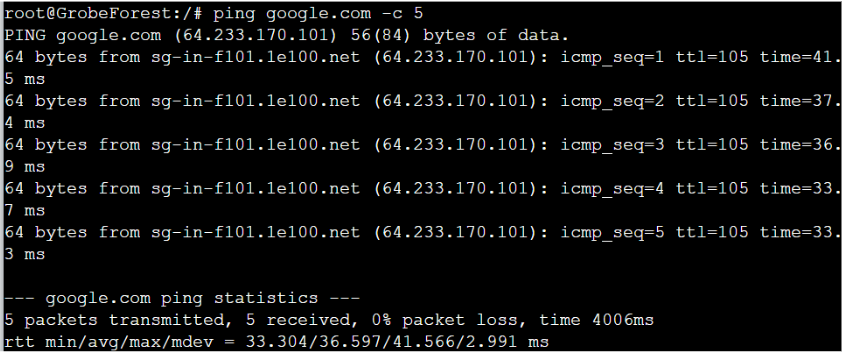

<h3>Soal 2</h3>

Kalian diminta untuk melakukan drop semua TCP dan UDP kecuali port 8080 pada TCP.

<h4>Solusi</h4> <a name="solusi2"></a>

TurkRegion:
```
echo 'nameserver 192.168.122.1' > /etc/resolv.conf

apt-get update
apt-get install netcat -y

iptables -A INPUT -p tcp --dport 8080 -j ACCEPT
iptables -A INPUT -p tcp -j DROP
iptables -A INPUT -p udp -j DROP
```
LaubHills:
```
echo 'nameserver 192.168.122.1' > /etc/resolv.conf

apt-get update
apt-get install netcat -y
```

dengan `echo 'nameserver 192.168.122.1' > /etc/resolv.conf` maka ini menambahkan baris nameserver 192.168.122.1 ke file /etc/resolv.conf. File ini digunakan oleh sistem operasi untuk menentukan server DNS yang digunakan untuk mengonversi nama domain menjadi alamat IP. Baris ini menunjukkan bahwa server DNS yang digunakan adalah 192.168.122.1.

Kemudian dilakukan `apt-get update` untuk mengunduh daftar paket terbaru dari repositori dan memperbarui daftar paket lokal pada sistem.

Selanjutnya dilakukan penginstalan netcat sebagi utilitas jaringan yang digunakan untuk membuka konekti TCP/UDP, mengirim dan menerima data melalui koneksi tersebut dengan perintah `apt-get install netcat -y` .

`iptables -A INPUT -p tcp --dport 8080 -j ACCEPT`: Perintah ini menambahkan aturan ke tabel iptables untuk mengizinkan koneksi TCP ke port 8080. Opsi `-A INPUT` menunjukkan bahwa aturan ditambahkan ke rantai INPUT pada tabel iptables. Opsi `-p tcp` menunjukkan bahwa aturan hanya berlaku untuk koneksi TCP. Opsi `--dport 8080` menunjukkan bahwa aturan hanya berlaku untuk koneksi yang ditujukan ke port 8080. Opsi `-j ACCEPT` menunjukkan bahwa koneksi yang cocok harus diterima.

`iptables -A INPUT -p tcp -j DROP`: Perintah ini menambahkan aturan ke tabel iptables untuk menolak semua koneksi TCP yang masuk. Opsi  `-A INPUT` menunjukkan bahwa aturan ditambahkan ke rantai INPUT pada tabel iptables. Opsi `-p tcp` menunjukkan bahwa aturan hanya berlaku untuk koneksi TCP. Opsi `-j DROP` menunjukkan bahwa koneksi yang cocok harus ditolak.

iptables `-A INPUT -p udp -j DROP`: Perintah ini menambahkan aturan ke tabel iptables untuk menolak semua koneksi UDP yang masuk. Opsi `-A INPUT` menunjukkan bahwa aturan ditambahkan ke rantai INPUT pada tabel iptables. Opsi `-p udp` menunjukkan bahwa aturan hanya berlaku untuk koneksi UDP. Opsi `-j DROP` menunjukkan bahwa koneksi yang cocok harus ditolak.

<h4>Testing</h4> <a name="testing2"></a>

TurkRegion:
```
nc -l -p 8080
```
LaubHills:
```
nc 10.43.8.2 8080
```
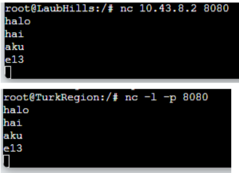

TurkRegion: 
```
nc -l -p 1234
```
LaubHills: 
```
nc 10.43.8.2 1234
```


<h3>Soal 3</h3>

Kepala Suku North Area meminta kalian untuk membatasi DHCP dan DNS Server hanya dapat dilakukan ping oleh maksimal 3 device secara bersamaan, selebihnya akan di drop.

<h4>Solusi</h4> <a name="solusi3"></a>

DNS Server (Richter):
```
iptables -A INPUT -m state --state ESTABLISHED,RELATED -j ACCEPT
iptables -A INPUT -p icmp -m connlimit --connlimit-above 3 --connlimit-mask 0 -j DROP
```

DHCP Server (Revolte):
```
iptables -A INPUT -m state --state ESTABLISHED,RELATED -j ACCEPT
iptables -A INPUT -p icmp -m connlimit --connlimit-above 3 --connlimit-mask 0 -j DROP
```
`iptables -A INPUT -m state --state ESTABLISHED,RELATED -j ACCEPT`: Perintah ini menambahkan aturan ke tabel iptables untuk mengizinkan koneksi yang sudah terbentuk dan terkait dengan koneksi yang sudah ada. Opsi `-A INPUT` menunjukkan bahwa aturan ditambahkan ke rantai INPUT pada tabel iptables. Opsi `-m state --state ESTABLISHED,RELATED` menunjukkan bahwa aturan hanya berlaku untuk koneksi yang sudah terbentuk dan terkait dengan koneksi yang sudah ada. Opsi `-j ACCEPT` menunjukkan bahwa koneksi yang cocok harus diterima.

`iptables -A INPUT -p icmp -m connlimit --connlimit-above 3 --connlimit-mask 0 -j DROP`: Perintah ini menambahkan aturan ke tabel iptables untuk menolak semua koneksi ICMP yang masuk ke sistem jika jumlah koneksi melebihi 3. Opsi `-A INPUT` menunjukkan bahwa aturan ditambahkan ke rantai INPUT pada tabel iptables. Opsi `-p icmp` menunjukkan bahwa aturan hanya berlaku untuk koneksi ICMP. Opsi `-m connlimit --connlimit-above 3 --connlimit-mask 0` menunjukkan bahwa aturan hanya berlaku untuk koneksi yang melebihi 3. Opsi `-j DROP` menunjukkan bahwa koneksi yang cocok harus ditolak.

<h4>Testing</h4> <a name="testing3"></a>

Hasil Testing pada 4 Client: 
```
ping 10.43.0.22
```

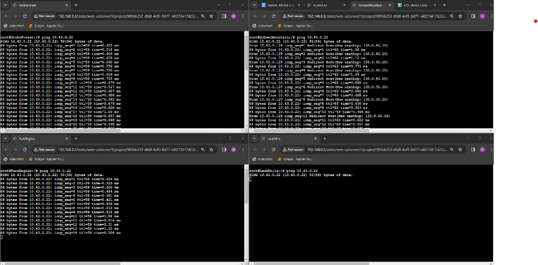

<h3>Soal 4</h3>

Lakukan pembatasan sehingga koneksi SSH pada Web Server hanya dapat dilakukan oleh masyarakat yang berada pada GrobeForest.

<h4>Solusi</h4> <a name="solusi4"></a>

Sein dan Stark:
iptables -A INPUT -p tcp --dport 22 -s 10.43.4.0 -j ACCEPT
iptables -A INPUT -p tcp --dport 22 -j DROP

iptables `-A INPUT -p tcp --dport 22 -s 10.43.4.0 -j ACCEPT`: Perintah ini menambahkan aturan ke tabel iptables untuk mengizinkan koneksi TCP ke port 22 dari alamat IP 10.43.4.0. Opsi `-A INPUT` menunjukkan bahwa aturan ditambahkan ke rantai INPUT pada tabel iptables. Opsi `-p tcp` menunjukkan bahwa aturan hanya berlaku untuk koneksi TCP. Opsi `--dport 22` menunjukkan bahwa aturan hanya berlaku untuk koneksi yang ditujukan ke port 22. Opsi `-s 10.43.4.0` menunjukkan bahwa aturan hanya berlaku untuk koneksi yang berasal dari alamat IP 10.43.4.0. Opsi `-j ACCEPT` menunjukkan bahwa koneksi yang cocok harus diterima.

`iptables -A INPUT -p tcp --dport 22 -j DROP`: Perintah ini menambahkan aturan ke tabel iptables untuk menolak semua koneksi TCP yang masuk ke port 22. Opsi `-A INPUT` menunjukkan bahwa aturan ditambahkan ke rantai INPUT pada tabel iptables. Opsi `-p tcp` menunjukkan bahwa aturan hanya berlaku untuk koneksi TCP. Opsi `--dport 22` menunjukkan bahwa aturan hanya berlaku untuk koneksi yang ditujukan ke port 22. Opsi `-j DROP` menunjukkan bahwa koneksi yang cocok harus ditolak.

<h4>Testing</h4> <a name="testing4"></a>

GrobeForest: 
```
nmap 10.43.4.3 -p 22
nmap 10.43.0.10 -p 22
```

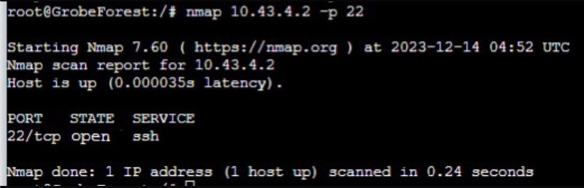

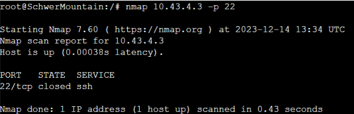

<h3>Soal 5</h3>

Selain itu, akses menuju WebServer hanya diperbolehkan saat jam kerja yaitu Senin-Jumat pada pukul 08.00-16.00.

<h4>Solusi</h4> <a name="solusi5"></a>

Sein dan Stark:
```
iptables -A INPUT -p tcp --dport 80 -m time --weekdays Mon,Tue,Wed,Thu,Fri --timestart 08:00 --timestop 16:00 -j ACCEPT
iptables -A INPUT -p tcp --dport 80 -j DROP
```

`iptables -A INPUT -p tcp --dport 80 -m time --weekdays Mon,Tue,Wed,Thu,Fri --timestart 08:00 --timestop 16:00 -j ACCEPT`: Perintah ini menambahkan aturan ke tabel iptables untuk mengizinkan koneksi TCP ke port 80 pada hari kerja (Senin hingga Jumat) antara pukul 08:00 dan 16:00. Opsi `-A INPUT` menunjukkan bahwa aturan ditambahkan ke rantai INPUT pada tabel iptables. Opsi `-p tcp` menunjukkan bahwa aturan hanya berlaku untuk koneksi TCP. Opsi `--dport 80` menunjukkan bahwa aturan hanya berlaku untuk koneksi yang ditujukan ke port 80. Opsi `-m time --weekdays Mon,Tue,Wed,Thu,Fri --timestart 08:00 --timestop 16:00` menunjukkan bahwa aturan hanya berlaku pada hari kerja (Senin hingga Jumat) antara pukul 08:00 dan 16:00. Opsi -j ACCEPT menunjukkan bahwa koneksi yang cocok harus diterima.

`iptables -A INPUT -p tcp --dport 80 -j DROP`: Perintah ini menambahkan aturan ke tabel iptables untuk menolak semua koneksi TCP yang masuk ke port 80. Opsi `-A INPUT` menunjukkan bahwa aturan ditambahkan ke rantai INPUT pada tabel iptables. Opsi `-p tcp` menunjukkan bahwa aturan hanya berlaku untuk koneksi TCP. Opsi `--dport 80` menunjukkan bahwa aturan hanya berlaku untuk koneksi yang ditujukan ke port 80. Opsi `-j DROP` menunjukkan bahwa koneksi yang cocok harus ditolak.

<h4>Testing</h4> <a name="testing5"></a>

Testing di hari kerja (GrobeForest): 
```
date --s “14 Dec 2023 10:00:00”
nmap 10.43.4.3 22
```
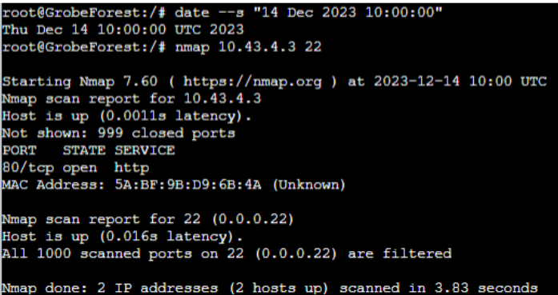

Testing di hari Minggu(GrobeForest:  
```
date --s “17 Dec 2023 10:00:00”
nmap 10.43.4.3 22
```

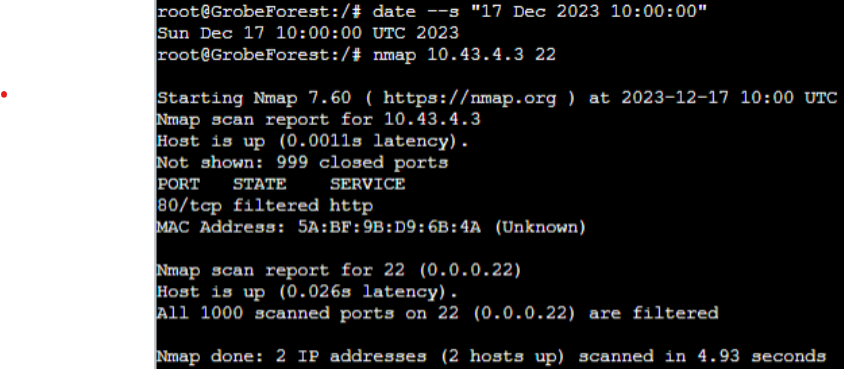

<h3>Soal 6</h3>

Lalu, karena ternyata terdapat beberapa waktu di mana network administrator dari WebServer tidak bisa stand by, sehingga perlu ditambahkan rule bahwa akses pada hari Senin - Kamis pada jam 12.00 - 13.00 dilarang (istirahat maksi cuy) dan akses di hari Jumat pada jam 11.00 - 13.00 juga dilarang (maklum, Jumatan rek).

<h4>Solusi</h4> <a name="solusi6"></a>

Sein dan Stark:
```
iptables -A INPUT -p tcp --dport 80 -m time --timestart 12:00 --timestop 13:00 --weekdays Mon,Tue,Wed,Thu -j DROP

iptables -A INPUT -p tcp --dport 80 -m time --timestart 11:00 --timestop 13:00 --weekdays Fri -j DROP
```

`iptables -A INPUT -p tcp --dport 80 -m time --timestart 12:00 --timestop 13:00 --weekdays Mon,Tue,Wed,Thu -j DROP`: Perintah ini menambahkan aturan ke tabel iptables untuk menolak semua koneksi TCP yang masuk ke port 80 pada hari kerja (Senin hingga Kamis) antara pukul 12:00 dan 13:00. Opsi -A INPUT menunjukkan bahwa aturan ditambahkan ke rantai INPUT pada tabel iptables. Opsi `-p tcp` menunjukkan bahwa aturan hanya berlaku untuk koneksi TCP. Opsi `--dport 80` menunjukkan bahwa aturan hanya berlaku untuk koneksi yang ditujukan ke port 80. Opsi `-m time --timestart 12:00 --timestop 13:00 --weekdays Mon,Tue,Wed,Thu` menunjukkan bahwa aturan hanya berlaku pada hari kerja (Senin hingga Kamis) antara pukul 12:00 dan 13:00. Opsi `-j DROP` menunjukkan bahwa koneksi yang cocok harus ditolak.

`iptables -A INPUT -p tcp --dport 80 -m time --timestart 11:00 --timestop 13:00 --weekdays Fri -j DROP`: Perintah ini menambahkan aturan ke tabel iptables untuk menolak semua koneksi TCP yang masuk ke port 80 pada hari Jumat antara pukul 11:00 dan 13:00. Opsi -A INPUT menunjukkan bahwa aturan ditambahkan ke rantai INPUT pada tabel iptables. Opsi `-p tcp` menunjukkan bahwa aturan hanya berlaku untuk koneksi TCP. Opsi `--dport 80` menunjukkan bahwa aturan hanya berlaku untuk koneksi yang ditujukan ke port 80. Opsi `-m time --timestart 11:00 --timestop 13:00 --weekdays Fri` menunjukkan bahwa aturan hanya berlaku pada hari Jumat antara pukul 11:00 dan 13:00. Opsi `-j DROP` menunjukkan bahwa koneksi yang cocok harus ditolak.

<h4>Testing</h4> <a name="testing6"></a>

Testing di hari Kamis jam 12.15 (jam istirahat)GrobeForest: 
```
nmap 10.43.4.3 -p 22
```

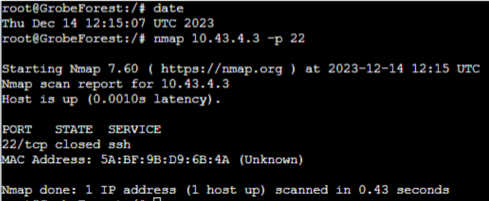

Testing saat Jumatan:
```
nmap 10.43.4.3 -p 22
```


<h3>Soal 7</h3>

Karena terdapat 2 WebServer, kalian diminta agar setiap client yang mengakses Sein dengan Port 80 akan didistribusikan secara bergantian pada Sein dan Stark secara berurutan dan request dari client yang mengakses Stark dengan port 443 akan didistribusikan secara bergantian pada Sein dan Stark secara berurutan.

<h4>Solusi</h4> <a name="solusi7"></a>

<h4>Testing</h4> <a name="testing7"></a>

<h3>Soal 8</h3>

Karena berbeda koalisi politik, maka subnet dengan masyarakat yang berada pada Revolte dilarang keras mengakses WebServer hingga masa pencoblosan pemilu kepala suku 2024 berakhir. Masa pemilu (hingga pemungutan dan penghitungan suara selesai) kepala suku bersamaan dengan masa pemilu Presiden dan Wakil Presiden Indonesia 2024.

<h4>Solusi</h4> <a name="solusi8"></a>

Sein dan Stark:
```
iptables -A INPUT -p tcp -s 10.43.0.20/30 --dport 80 -m time --datestart "2023-10-19T00:00" --datestop "2024-02-15T00:00" -j DROP
```

`iptables -A INPUT -p tcp -s 10.43.0.20/30 --dport 80 -m time --datestart "2023-10-19T00:00" --datestop "2024-02-15T00:00" -j DROP`: Perintah ini menambahkan aturan ke tabel iptables untuk menolak semua koneksi TCP yang masuk ke port 80 dari jaringan 10.43.0.20/30 antara tanggal 19 Oktober 2023 dan 15 Februari 2024. Opsi `-A INPUT` menunjukkan bahwa aturan ditambahkan ke rantai INPUT pada tabel iptables. Opsi `-p tcp` menunjukkan bahwa aturan hanya berlaku untuk koneksi TCP. Opsi `-s 10.43.0.20/30` menunjukkan bahwa aturan hanya berlaku untuk koneksi yang berasal dari jaringan 10.43.0.20/30. Opsi `--dport 80` menunjukkan bahwa aturan hanya berlaku untuk koneksi yang ditujukan ke port 80. Opsi `-m time --datestart "2023-10-19T00:00" --datestop "2024-02-15T00:00"` menunjukkan bahwa aturan hanya berlaku antara tanggal 19 Oktober 2023 dan 15 Februari 2024. Opsi `-j DROP` menunjukkan bahwa koneksi yang cocok harus ditolak.

<h4>Testing</h4> <a name="testing8"></a>

Catatn: IP Sein 10.43.4.3 dan IP Stark 10.43.0.10

Waktu Masa Pemilu (14 Desember 2023) di Revolte

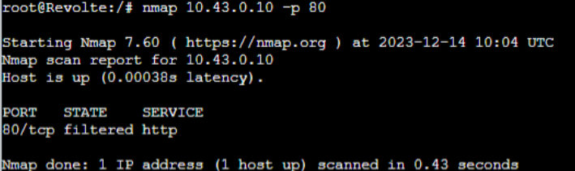

Di Luar Masa Pemilu (14 Desember 2025) di Revolte

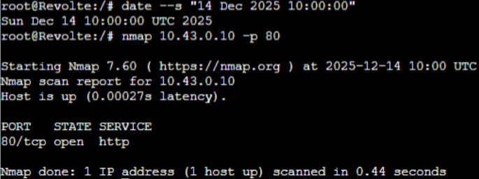

Waktu Masa Pemilu selain Revolte:

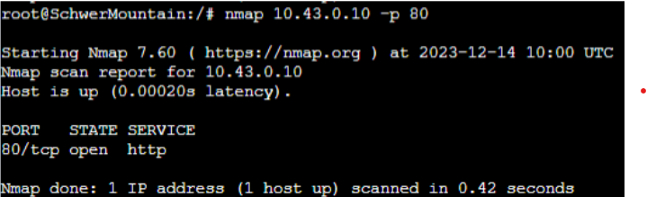

Di Luar Masa Pemilu selain Revolte:

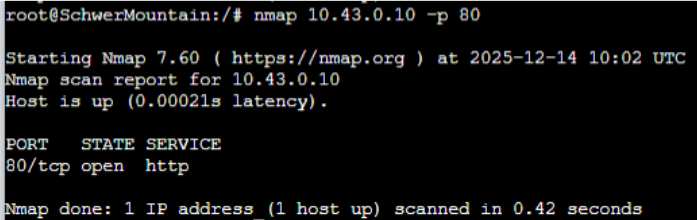

<h3>Soal 9</h3>

Sadar akan adanya potensial saling serang antar kubu politik, maka WebServer harus dapat secara otomatis memblokir  alamat IP yang melakukan scanning port dalam jumlah banyak (maksimal 20 scan port) di dalam selang waktu 10 menit. 

<h4>Solusi</h4> <a name="solusi9"></a>

Sein & Stark:
```
iptables -F
iptables -N scan_port
iptables -A INPUT -m recent --name scan_port --update --seconds 600 --hitcount 20 -j DROP
iptables -A FORWARD -m recent --name scan_port --update --seconds 600 --hitcount 20 -j DROP
iptables -A INPUT -m recent --name scan_port --set -j ACCEPT
iptables -A FORWARD -m recent --name scan_port --set -j ACCEPT
```

dengan `iptables -F`: Perintah ini menghapus semua aturan dari semua rantai pada tabel iptables. Ini akan menghapus semua aturan yang sebelumnya ditambahkan ke tabel iptables.

`iptables -N scan_port`: Perintah ini membuat rantai baru bernama scan_port pada tabel iptables. Rantai ini akan digunakan untuk menangani koneksi yang mencoba melakukan pemindaian port.

`iptables -A INPUT -m recent --name scan_port --update --seconds 600 --hitcount 20 -j DROP`: Perintah ini menambahkan aturan ke rantai INPUT pada tabel iptables untuk menolak semua koneksi yang mencoba melakukan pemindaian port. Opsi `-m recent --name scan_port --update --seconds 600 --hitcount 20` menunjukkan bahwa aturan hanya berlaku untuk koneksi yang mencoba melakukan pemindaian port lebih dari 20 kali dalam 10 menit terakhir. Opsi `-j DROP` menunjukkan bahwa koneksi yang cocok harus ditolak.

`iptables -A FORWARD -m recent --name scan_port --update --seconds 600 --hitcount 20 -j DROP`: Perintah ini menambahkan aturan ke rantai FORWARD pada tabel iptables untuk menolak semua koneksi yang mencoba melakukan pemindaian port. Opsi `-m recent --name scan_port --update --seconds 600 --hitcount 20` menunjukkan bahwa aturan hanya berlaku untuk koneksi yang mencoba melakukan pemindaian port lebih dari 20 kali dalam 10 menit terakhir. Opsi `-j DROP` menunjukkan bahwa koneksi yang cocok harus ditolak.

`iptables -A INPUT -m recent --name scan_port --set -j ACCEPT`: Perintah ini menambahkan aturan ke rantai INPUT pada tabel iptables untuk mengizinkan koneksi yang mencoba melakukan pemindaian port. Opsi `-m recent --name scan_port --set` menunjukkan bahwa aturan hanya berlaku untuk koneksi yang mencoba melakukan pemindaian port untuk pertama kalinya. Opsi `-j ACCEPT` menunjukkan bahwa koneksi yang cocok harus diterima.

`iptables -A FORWARD -m recent --name scan_port --set -j ACCEPT`: Perintah ini menambahkan aturan ke rantai FORWARD pada tabel iptables untuk mengizinkan koneksi yang mencoba melakukan pemindaian port. Opsi `-m recent --name scan_port --set` menunjukkan bahwa aturan hanya berlaku untuk koneksi yang mencoba melakukan pemindaian port untuk pertama kalinya. Opsi `-j ACCEPT` menunjukkan bahwa koneksi yang cocok harus diterima.

<h4>Testing</h4> <a name="testing9"></a>

GrabeForest: 
```
ping 10.43.4.3 (server Sein) 
```

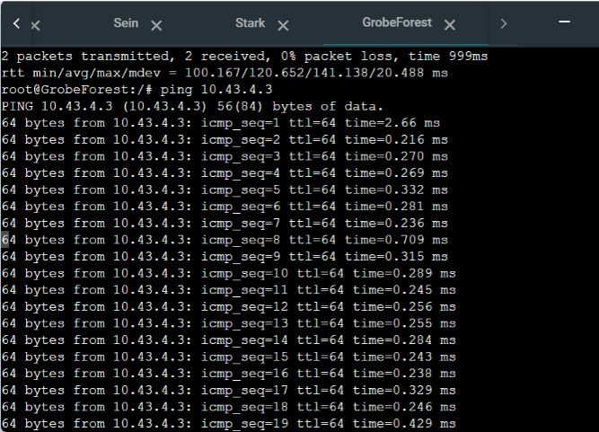

<h3>Soal 10</h3>

Karena kepala suku ingin tau paket apa saja yang di-drop, maka di setiap node server dan router ditambahkan logging paket yang di-drop dengan standard syslog level. 

<h4>Solusi</h4> <a name="solusi10"></a>

Semua router dan server: 
```
iptables -A INPUT -j LOG --log-level info --log-prefix "DROPPED: "
```
Perintah `iptables -A INPUT -j LOG --log-level info --log-prefix "DROPPED: "` menambahkan aturan ke rantai INPUT pada tabel iptables untuk menulis pesan log ke sistem ketika paket ditolak. Opsi `-j LOG` menunjukkan bahwa pesan log harus ditulis ke sistem. Opsi `--log-level info` menunjukkan bahwa pesan log harus ditulis dengan level informasi. Opsi `--log-prefix "DROPPED: " ` menunjukkan bahwa pesan log harus dimulai dengan string "DROPPED: ".


<h4>Testing</h4> <a name="testing10"></a>

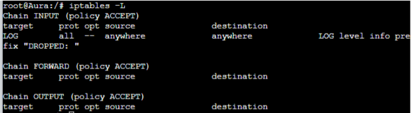
